# Procesverslag
**Auteur:** Jeroen Bouhuijs

Markdown cheat cheet: [Hulp bij het schrijven van Markdown](https://github.com/adam-p/markdown-here/wiki/Markdown-Cheatsheet). Nb. de standaardstructuur en de spartaanse opmaak zijn helemaal prima. Het gaat om de inhoud van je procesverslag. Besteedt de tijd voor pracht en praal aan je website.

## Bronnenlijst
1. Carrousel (https://www.youtube.com/watch?v=KcdBOoK3Pfw&ab_channel=DevEd)
2. W3schools (https://www.w3schools.com/)
3. HTML Unicode (https://www.w3schools.com/charsets/ref_utf_symbols.asp)
4. Thuisbezorgd (https://www.thuisbezorgd.nl/)
5. Stackoverflow (https://stackoverflow.com/)
6. Css Tricks (https://css-tricks.com/)

## Eindgesprek (week 7/8)

Het lastigste van dit hele traject was voor mij veruit het goed positioneren van elementen en dat deze ook semantisch correct zouden zijn. Ik heb hier heel veel tijd in gestopt en ben ook uiteindelijk erg blij met het eindresultaat wat betreft de content, hoe responsive het is en hoe het nu vergeleken met elkaar staat. Daarnaast heb ik veel geleerd over nieuwe manieren om te positioneren. Ik heb voor een aantal content elementen grids gebruikt en voor een aantal ook flex. Op deze manier kan je makkelijkere ordenen in plaats van dat je de hele tijd position: relative en position: absolute gebruikt.

**Screenshot(s):**

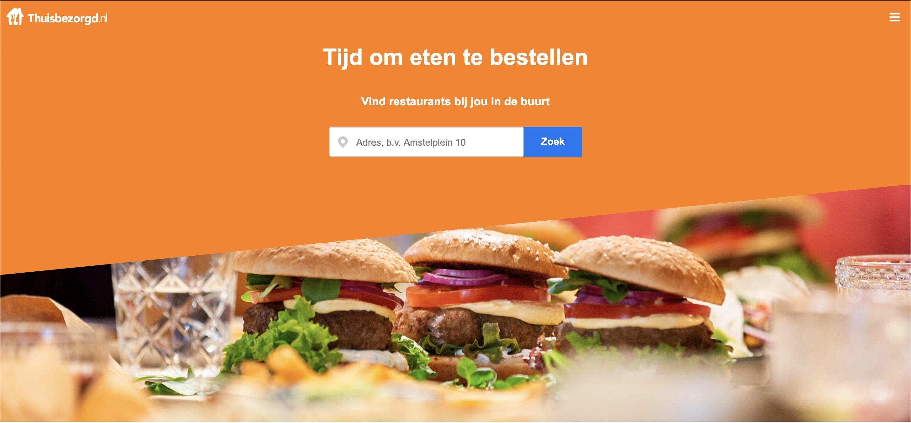
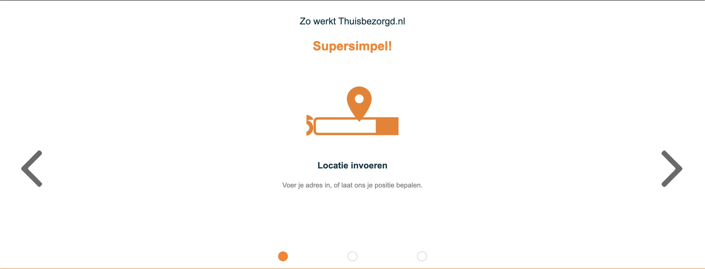
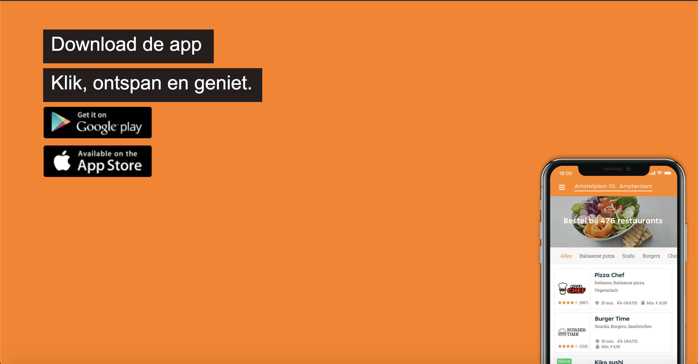
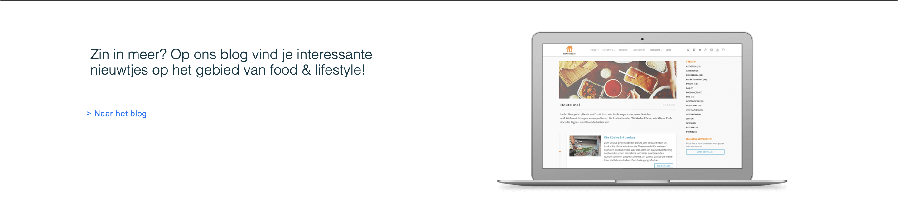
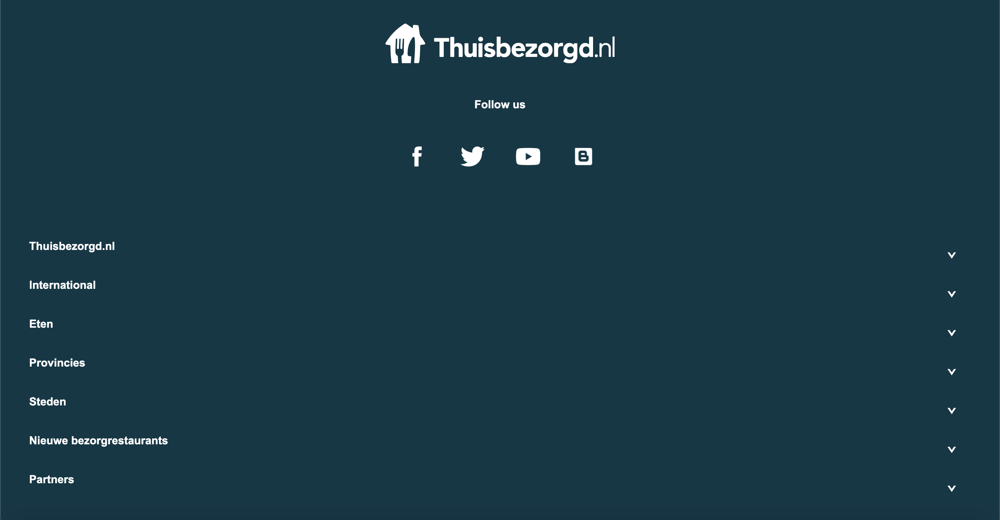
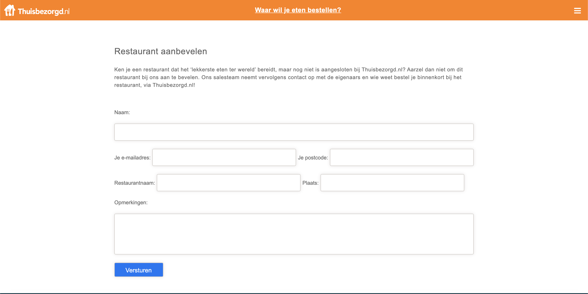
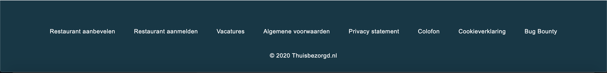

## Voortgang 3 (week 6)

Feedback:
- Op div een class Polygon (duidelijk maken)
- Class namen fixen
- Bronvermelding carrousel
- AdresP class weghalen en goed maken 
- Zoveel mogelijk em ipv px gebruiken
- Width van section form input naar 77% veranderen

Stand van zaken:
Ik heb erg veel moeite gehad met het responsive maken van veel van de inhoud. Een aantal elementen is het gelukt om dit uiteindelijk te fixen. Daarnaast is JS nog steeds erg vaag. Ik heb nog steeds het probleem met de carrousel opgelost. Hij is wel responsive geworden ondertussen. Het opschonen van de HTML en CSS is ook nog een hele uitdaging.

## Voortgang 2 (week 5)

**Screenshot(s):**

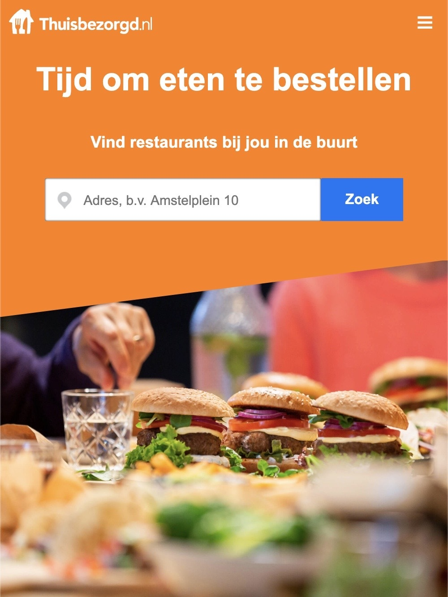
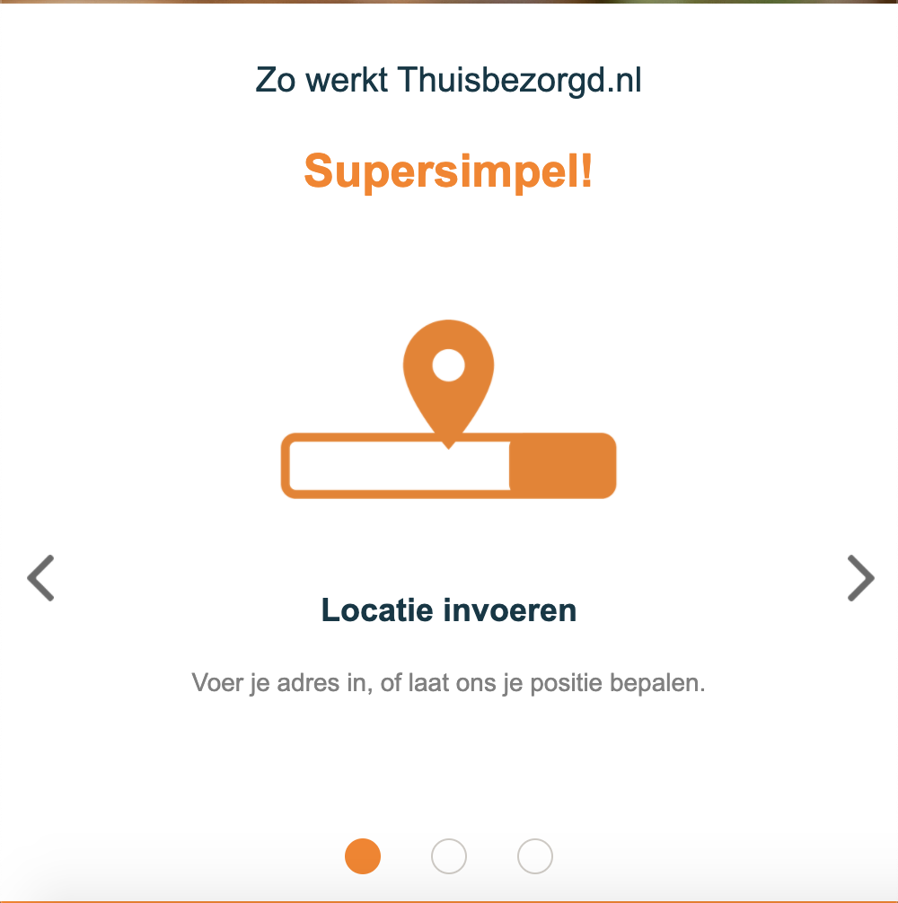
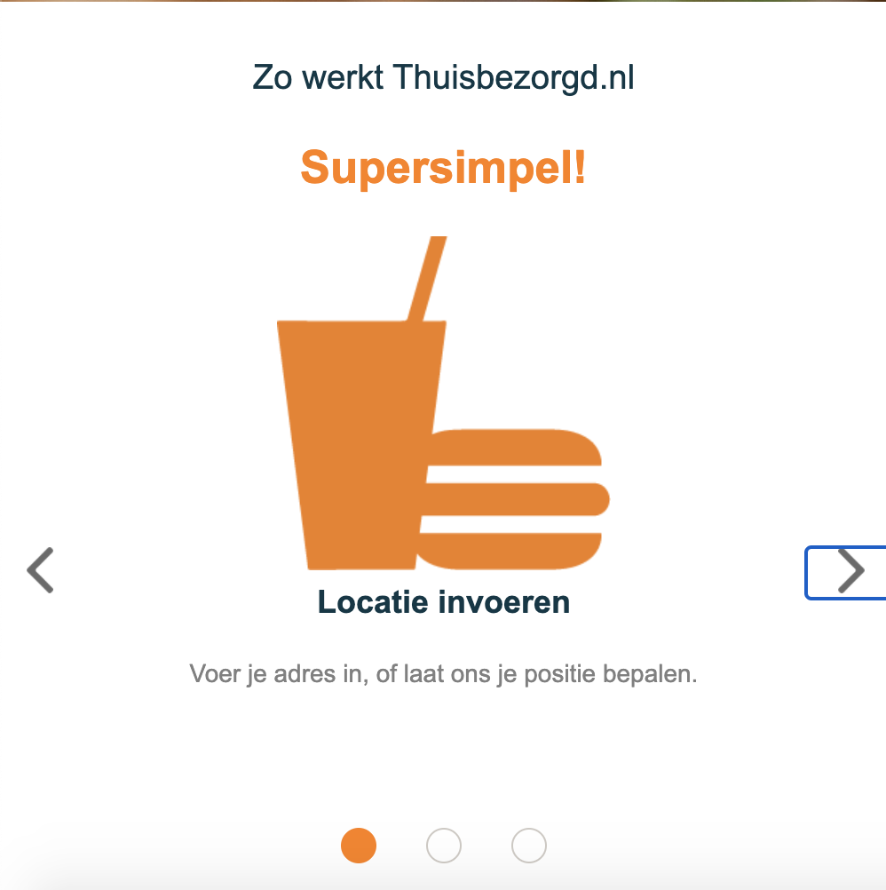
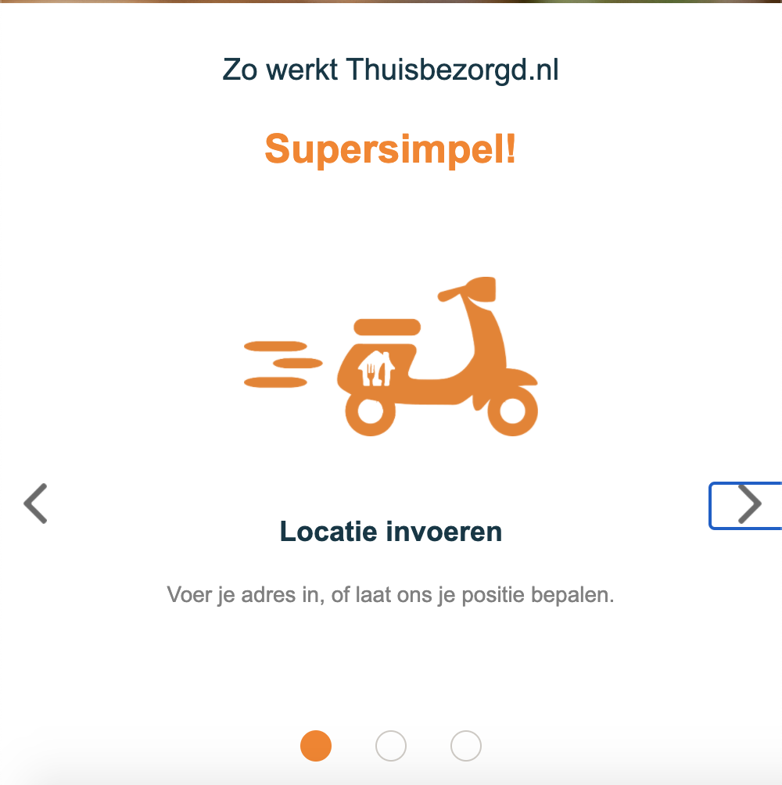

Feedback:
- Kijken naar de em's ipv pixels
- Css en html is goed, paar kleine dingetjes die gefixt moeten worden
- Bij een aantal dingen uitleg geven waarom ik dit heb gedaan
- Form kan zonder grind, maar dan moet er wel een margin-auto op
- H3 en H4 responsive al maken
- Background-image van de hamburgers maken

Stand van zaken:
Ik loop zelf met een aantal dingetjes vast, zoals de carrousel en het positioneren van elementen. Ik probeer hier ook zo veel mogelijk hulp mee te vragen, alleen wil ik het eerst zelf altijd proberen, wat vaak veel tijd kost. Vooral het positioneren en stijlen vind ik lastig

## Voortgang 1 (week 3)

Stand van zaken:
Voor mijn gevoel ging alles wel redelijk soepel, het lastigste vond ik de positionering. Dit heb ik tot nu toe ook nog niet heel netjes gedaan, dus dat moet ik nog veranderen. Ik zat zelf aan het gebruik van grids te denken, om makkelijk overzicht te houden over de layout. Voor de rest moet ik ook gaan letten op overbodige css.

**Screenshot(s):**

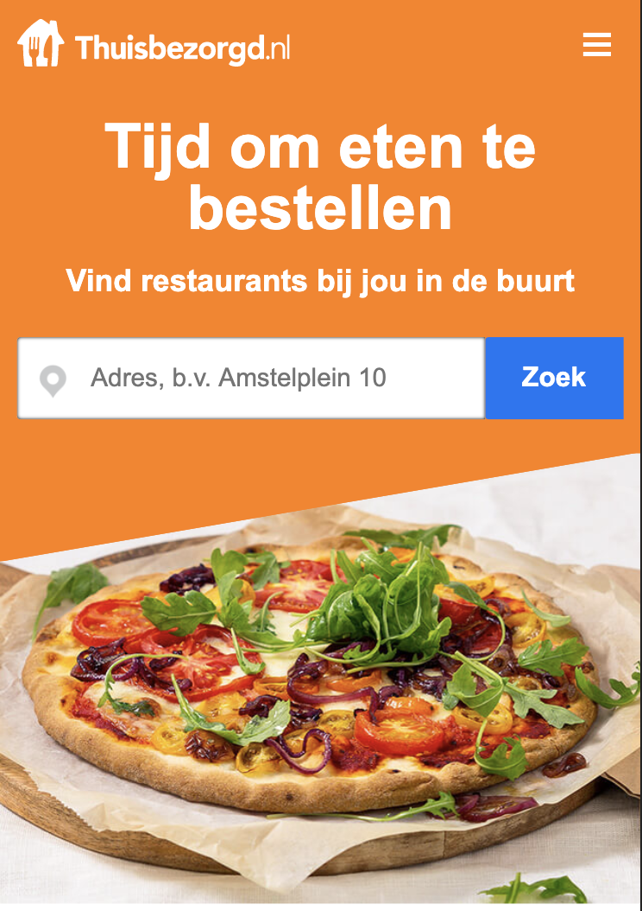

### Agenda voor meeting

-samen met je groepje opstellen-

### Verslag van meeting

Comment in html bij Unicode zetten wat ik gedaan heb

- Beperkingen en voordelen er bij zetten

Header flex box doen - Position absolute naar flex box

Clip-path documentatie, hoe werkt het?

Css opschonen!!!

## Intake (week 1)

**Je startniveau:** Blauw

**Je focus:** Responsive

**Je opdracht:** https://www.thuisbezorgd.nl/

**Screenshot(s):**

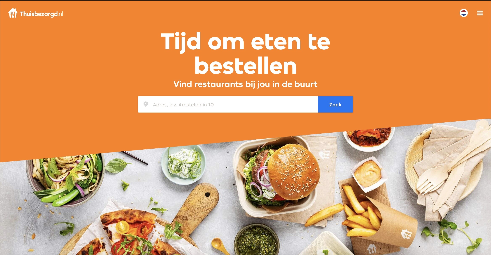

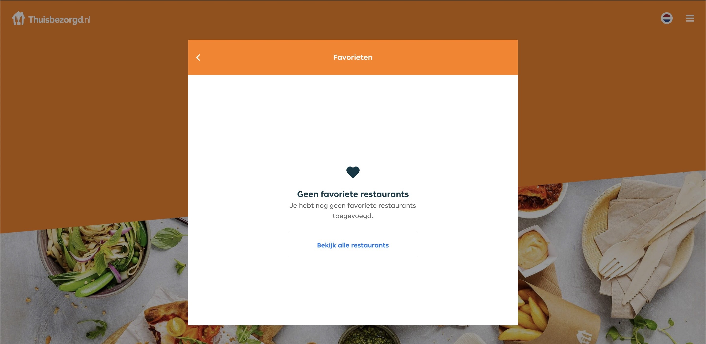

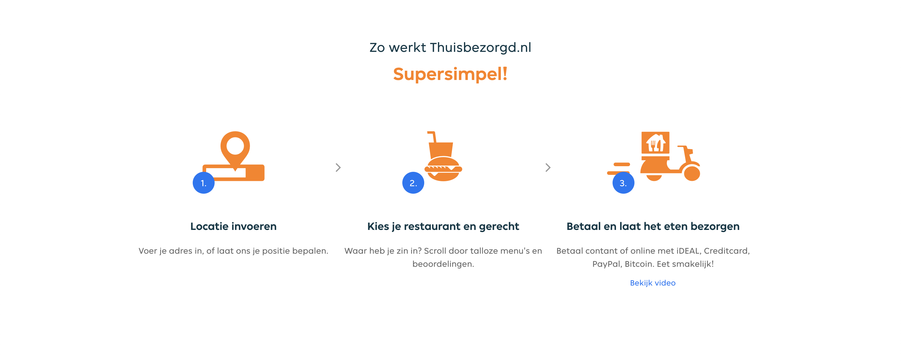

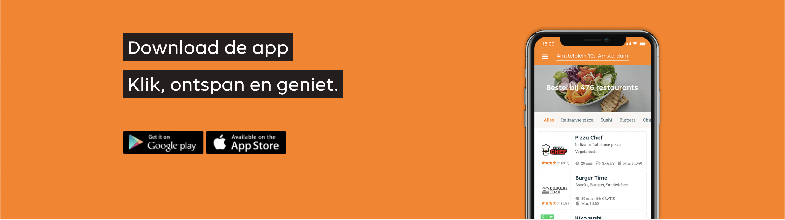

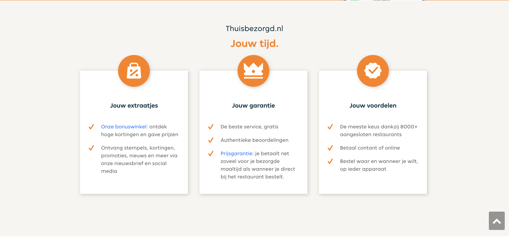

**Breakdown-schets(en):**

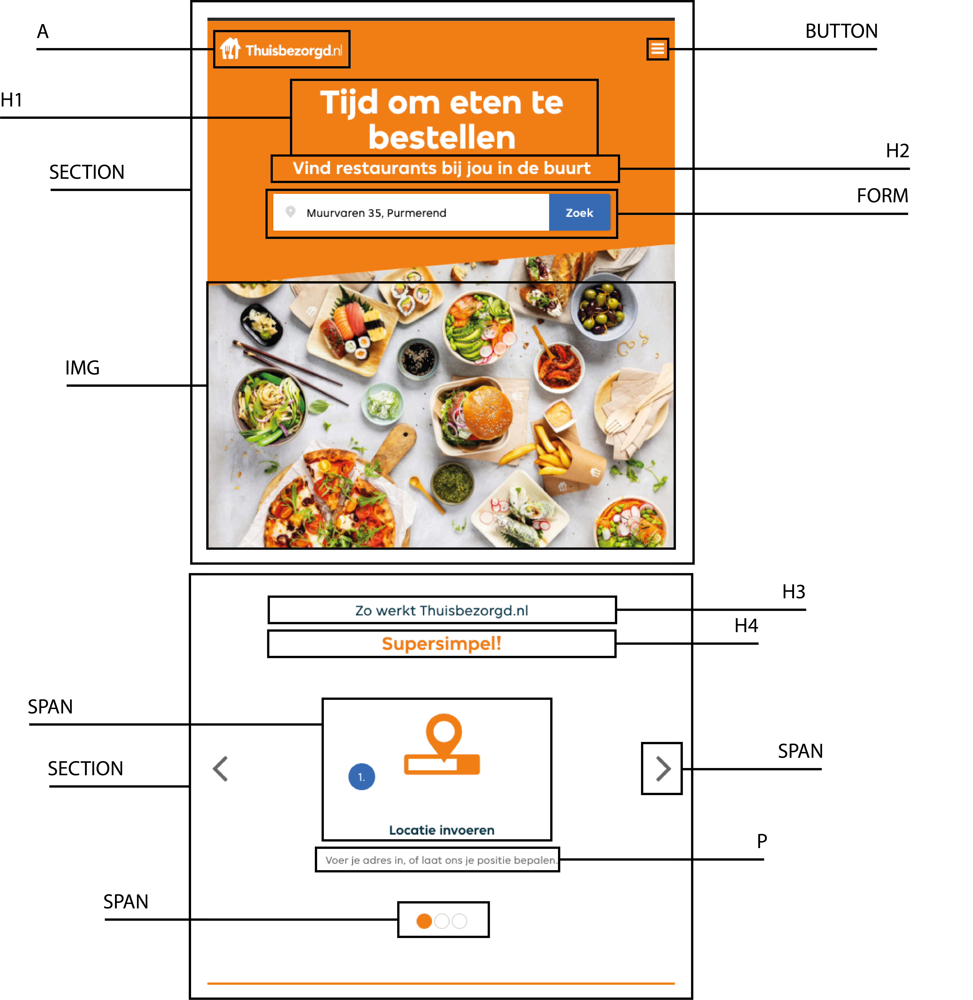
